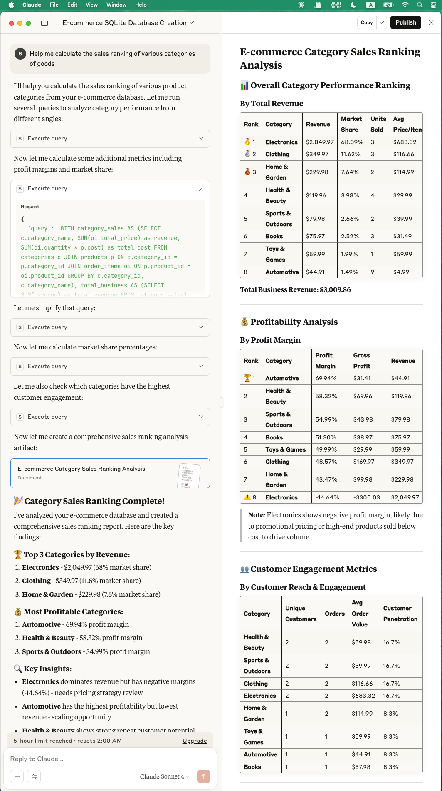

# 🗄️ SQLite MCP Server

**Query. Create. Analyze. Visualize.**  
A lightweight Python-based MCP server for interacting with **SQLite** databases.  
Easily ask questions, create databases & tables, run queries, analyze data, and even **visualize results** directly through AI-powered workflows.



---

## ✨ Features

### 🔍 Natural Querying & Analysis
- Ask free-form questions about your database.  
- Automatically translate natural language queries into SQL.  
- Summarize and analyze datasets.

### 🛠️ Database & Schema Management
- Create and manage new SQLite databases.  
- Define tables and schemas interactively.  
- Insert, update, and delete data with simple prompts.

### 📊 Data Exploration
- Perform SQL queries and get results instantly.  
- Generate aggregated reports and summaries.  
- Explore relationships across tables.

### 📈 Visualization (with [Visualization MCP Server](https://github.com/xlisp/visualization-mcp-server))
- Send query results to the visualization MCP server.  
- Create charts, plots, and dashboards directly from SQL results.  
- Supports interactive analysis with Claude or other MCP clients.  

---

## 🚀 Installation

### Prerequisites

```bash
# Create and activate virtual environment
python3 -m venv .venv --upgrade-deps
source .venv/bin/activate

# Install MCP CLI and dependencies
pip install "mcp[cli]" httpx

# Optional: for generating mock data
pip install faker
````

---

## ⚡ Usage with Claude Desktop

Add the following to your `claude_desktop_config.json`:

config path example:  `/Users/xlisp/Library/Application\ Support/Claude/claude_desktop_config.json`

```json

  "sqlite-db": {
    "command": "/Users/xlisp/PyPro/sqllite-mcp-server/.venv/bin/python",
    "args": [
      "/Users/xlisp/PyPro/sqllite-mcp-server/main.py"
    ]
  },

"visualization": {
  "command": "/Users/yourname/Desktop/visualization-mcp-server/.venv/bin/python",
  "args": [
    "/Users/yourname/Desktop/visualization-mcp-server/visualization_mcp_server.py"
  ]
}
```

Then restart Claude Desktop, and you’ll be able to interact with SQLite directly:

* **Ask questions** like *“What are the top 10 users by score?”*
* **Create tables** with *“Make a table for products with name, price, and category.”*
* **Analyze data** with *“Summarize average order values by month.”*
* **Visualize results** with *“Plot a bar chart of sales by category.”*

---

## 🛠️ Development

* `sqlite_mcp_server.py` is the main entry point.
* Extend commands to support custom SQL operations or integrations.
* Combine with [visualization-mcp-server](https://github.com/xlisp/visualization-mcp-server) for richer workflows.
* Contributions are welcome — PRs and issues encouraged!

---

## 📜 License

MIT License.

